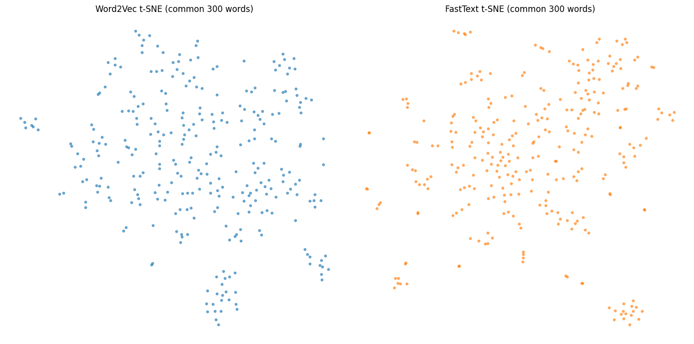

# CENG 442 - Assignment 1: Word Embedding Benchmark (Word2Vec vs. FastText)


## 1. Overview & Goal

This project, developed for the CENG 442 Natural Language Processing course, involves preprocessing five different Azerbaijani sentiment datasets to build a unified, domain-aware corpus.

The primary goal is to train and benchmark two popular word embedding models, **Word2Vec** and **FastText**, on this corpus. The evaluation compares the models based on lexical coverage, semantic similarity (synonyms/antonyms), nearest neighbor analysis, and t-SNE visualization to understand their respective strengths in capturing Azerbaijani semantics.

## 2. Project Workflow

The notebook (`NLP_SentimentAnalysis.ipynb`) follows this pipeline:

1.  **Data Preprocessing:** Each of the five raw XLSX files is loaded and passed through a custom preprocessing pipeline.
2.  **Corpus Building:** The cleaned text from all datasets is aggregated into a single `corpus_all.txt` file, with each line tagged by its inferred domain.
3.  **Model Training:** `Word2Vec` and `FastText` (skip-gram, 300 dimensions) are trained on the unified corpus.
4.  **Evaluation & Visualization:** The trained models are benchmarked quantitatively (similarity scores) and qualitatively (nearest neighbors, t-SNE).

## 3. Data Preprocessing & Normalization

A robust preprocessing pipeline (`normalize_text_az`) was created to handle the nuances of Azerbaijani and web-based text:

* **AZ-Specific Lowercasing:** Correctly handles Turkish/Azerbaijani characters (e.g., `I`→`ı`, `İ`→`i`).
* **Text Cleaning:** Removes HTML tags, URLs, email addresses, and phone numbers.
* **Token Mapping:**
    * Emojis are mapped to standardized tokens (e.g., `🙂` → `EMO_POS`).
    * Common slang is standardized (e.g., `tmm` → `tamam`).
* **Negation Handling:** Propagates a `_NEG` suffix to the three words following a negation term (e.g., `yox`, `deyil`) to capture inverted sentiment.
* **Domain-Specific Normalization:**
    * Detects the text domain (news, social, reviews, general).
    * For "reviews," it normalizes price and rating expressions (e.g., `5 ulduz` → `<STARS_5>`, `çox yaxşı` → `<RATING_POS>`).
* **Sentiment Mapping:** Sentiment labels (e.g., "positive", "neg", "1", "0") are unified into a 3-class numeric format: **{1.0: Positive, 0.5: Neutral, 0.0: Negative}**.
* **Output:** Each dataset is saved as a `_2col.xlsx` file, and a unified `corpus_all.txt` (124,353 lines) is generated for model training.

## 4. Evaluation & Results

Both models were trained with `vector_size=300`, `window=5`, `sg=1` (skip-gram), and `10 epochs`.

### Quantitative Analysis

* **Lexical Coverage:** Both models achieved high vocabulary coverage (~93-99%) on the test datasets.
* **Semantic Similarity:** FastText achieved slightly higher cosine similarity scores for synonyms (0.437 vs. 0.358), but Word2Vec demonstrated better semantic *separation* (the difference between synonym and antonym similarity was 0.030 for W2V vs. 0.009 for FT).
* **Mean Neighbor Similarity:** FastText's word clusters are significantly "tighter," with a mean top-5 neighbor similarity of **0.790**, compared to Word2Vec's **0.528**.

### Qualitative Analysis (Nearest Neighbors & t-SNE)

The qualitative analysis revealed the core difference between the models:

* **Word2Vec:** Groups words by **semantic context**.
    * `yaxşı` (good) → `iyi` (good), `<RATING_POS>`, `əla` (great)
    * `bahalı` (expensive) → `yaxtaları` (yachts), `villaları` (villas), `qiymətli` (valuable)
* **FastText:** Groups words by **morphology** (using subword information).
    * `yaxşı` (good) → `yaxşıı`, `yaxşıkı`, `yaxşıca` (morphological variations of "good")
    * `bahalı` (expensive) → `bahalıı`, `bahalısı`, `pahalı` (morphological variations)

This is confirmed by the t-SNE plots:
* **Word2Vec (left)** shows tighter, more distinct semantic clusters.
* **FastText (right)** shows broader, more connected clusters linked by morphological roots.



## 5. Conclusion

The benchmark demonstrates a clear trade-off:

* **Word2Vec** excels at capturing abstract **semantic context**, grouping words that are used in similar situations (e.g., "expensive" and "villas").
* **FastText** is superior at **morphological generalization**. Its subword-based approach allows it to understand word structure, making it more robust for morphologically rich languages like Azerbaijani and better at handling rare or misspelled words.

## 6. How to Run

1.  **Install Dependencies:**
    ```bash
    pip install pandas gensim openpyxl regex ftfy scikit-learn matplotlib
    ```
2.  **Place Datasets:** Ensure the five source `.xlsx` files are in the same directory as the notebook:
    * `labeled-sentiment.xlsx`
    * `test__1_.xlsx`
    * `train__3_.xlsx`
    * `train-00000-of-00001.xlsx`
    * `merged_dataset_CSV__1_.xlsx`
3.  **Run Notebook:** Open and run the `NLP_SentimentAnalysis.ipynb` notebook. The script will generate the `_2col.xlsx` files, the `corpus_all.txt`, the embedding models in the `/embeddings` folder, and all evaluation plots.
